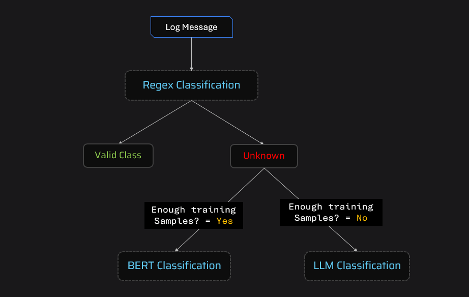

# 🚀 Log Classification System: Hybrid AI-Powered Framework

Welcome to the **Log Classification System**! This project is a robust, production-ready solution for classifying log messages using a hybrid approach that combines **Regex**, **Machine Learning (BERT + Logistic Regression)**, and **Large Language Models (LLMs)**. It features a modern **React + Vite** frontend, a scalable **FastAPI** backend, and is fully containerized with **Docker** for easy deployment.

---

## 📸 [Video Demo](https://drive.google.com/file/d/1YYo5-O3kUDNjOMb7RweLPCOKc9U8GzHC/view?usp=sharing)

---

## 🏗️ Architecture



- **Frontend**: React + Vite + TailwindCSS for a fast, interactive dashboard.
- **Backend**: FastAPI serving REST endpoints for log classification and file handling.
- **Classification Engine**: Hybrid pipeline (Regex, BERT+LogReg, LLM).
- **Model Storage**: Pre-trained models and resources.
- **Dockerized**: One-command deployment.

---

## 🧠 Classification Pipeline

The system uses a **three-stage hybrid approach** for maximum accuracy and flexibility:

1. **🔍 Regex-based Classification**
   - Fast, rule-based matching for simple, predictable log patterns.
   - Example: `"User User123 logged in."` → `User Action`

2. **🤖 Machine Learning (BERT + Logistic Regression)**
   - For complex patterns with sufficient labeled data.
   - Uses [Sentence Transformers](https://www.sbert.net/) to embed log messages, then classifies with Logistic Regression.
   - Example: `"IP 192.168.1.1 blocked due to potential attack"` → `Security Alert`

3. **🦾 LLM-based Classification (Gemini)**
   - For rare/ambiguous logs or when labeled data is insufficient.
   - Uses Google Gemini LLM via API for fallback classification.
   - Example: `"The 'BulkEmailSender' feature is no longer supported."` → `Deprecation Warning`

**Decision Flow:**
- If the log source is `LegacyCRM`, always use LLM.
- Else, try Regex. If no match, use BERT+LogReg. If still unclassified, fallback to LLM.

---

## 🧰 Tech Stack

| Layer      | Technology                                    |
|------------|-----------------------------------------------|
| Frontend   | React, Vite, TailwindCSS, Chart.js, Lucide    |
| Backend    | FastAPI, Python 3.11, Pandas, Uvicorn         |
| ML Models  | Sentence Transformers (BERT), scikit-learn    |
| LLM        | Google Gemini API                             |
| DevOps     | Docker, Git                                   |

---

## 🗂️ Project Structure

```
log-classification/
│
├── log-classfication-frontend/   # React + Vite frontend
│   └── ...                      # UI, charts, dashboard
│
├── server.py                    # FastAPI backend
├── classify.py                  # Hybrid classification logic
├── processor_regex.py           # Regex rules
├── processor_bert.py            # BERT + Logistic Regression
├── processor_llm.py             # Gemini LLM integration
├── models/                      # Saved ML models
├── resources/                   # Test data, outputs, architecture image
├── requirements.txt             # Python dependencies
├── Dockerfile                   # Multi-stage Docker build
└── .env                         # API keys and secrets
```

---

## 🛠️ How It Works

### 1. **Upload Logs**
- Upload a `.csv` file with columns: `source`, `log_message` via the dashboard.

### 2. **Preview & Classify**
- Preview the first few rows.
- Click "Classify Logs" to trigger the backend pipeline.

### 3. **Hybrid Classification**
- Each log is processed through Regex, BERT+LogReg, and LLM as needed.
- Results are aggregated and returned.

### 4. **Visualize & Download**
- View statistics, pie/bar charts, per-class source breakdowns.
- Download the classified output and statistics as CSV.

---

## 🧑‍💻 Example Workflow

1. **Start the Backend**
   ```bash
   uvicorn server:app --reload
   ```
2. **Start the Frontend**
   ```bash
   cd log-classfication-frontend
   npm install
   npm run dev
   ```
3. **Or Run Everything with Docker**
   ```bash
   docker build -t log-classification .
   docker run -p 8000:8000 log-classification
   ```
4. **Open the App**
   - Visit [http://localhost:8000](http://localhost:8000) in your browser.

---

## 🧪 Model Details

- **Regex**: Custom patterns for common log actions.
- **BERT**: `all-MiniLM-L6-v2` Sentence Transformer for embeddings.
- **Logistic Regression**: Trained on labeled log data.
- **LLM**: Google Gemini (API key required in `.env`).

---

## 📊 Dashboard Features

- **Input/Output Preview**: See sample logs and predictions.
- **Statistics Table**: Class counts, percentages, sources.
- **Pie & Bar Charts**: Visualize class and source distributions.
- **Per-Class Source Charts**: See which sources generate which log types.
- **Interactive Filtering**: Filter output by log class.
- **Download**: Get output and statistics as CSV.

---

## 🐳 Docker & Deployment

- **Multi-stage Dockerfile**: Builds both backend and frontend, serves static files via FastAPI.
- **Single-container deployment**: All-in-one for easy cloud or on-prem deployment.
- **Environment Variables**: Place your `GEMINI_API_KEY` in `.env`.
- **Official Docker Image**:  
  👉 Pull and run directly from Docker Hub:  
  ```bash
  docker pull komal2203/log-classification:latest
  docker run -p 8000:8000 --env-file .env komal2203/log-classification:latest
  ```
  [View on Docker Hub](https://hub.docker.com/u/komal2203)

---

## 📝 Git Usage

- **Clone the repo**:
  ```bash
  git clone https://github.com/yourusername/log-classification.git
  ```
- **Branching**: Use feature branches for new features.
- **Pull Requests**: Submit PRs for review and CI/CD integration.

---

## 🏷️ Example Input/Output

**Input CSV:**
```csv
source,log_message
Billing System,Failed to connect to database
CRM,User login successful
```

**Output CSV:**
```csv
source,log_message,target_label
Billing System,Failed to connect to database,Critical Error
CRM,User login successful,User Action
```

---

## 📚 Resources

- **Architecture Image**: See `resources/arch.png`
- **Test Data**: Example CSVs in `resources/`
- **Pre-trained Models**: In `models/`

---

## 💡 Why Hybrid?

- **Accuracy**: Combines strengths of rules, ML, and LLMs.
- **Flexibility**: Adapts to new log formats and rare cases.
- **Speed**: Fast for common logs, robust for edge cases.

---

